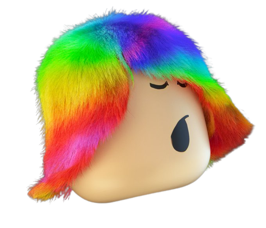

**SocialRainbow** is a module for Roblox based on WinnersTakeAll's Shime module, but it's different, the shime is a... **Rainbow!**
# 📄 Documentation
**Coming Soon,** i don't have time to write it now.

